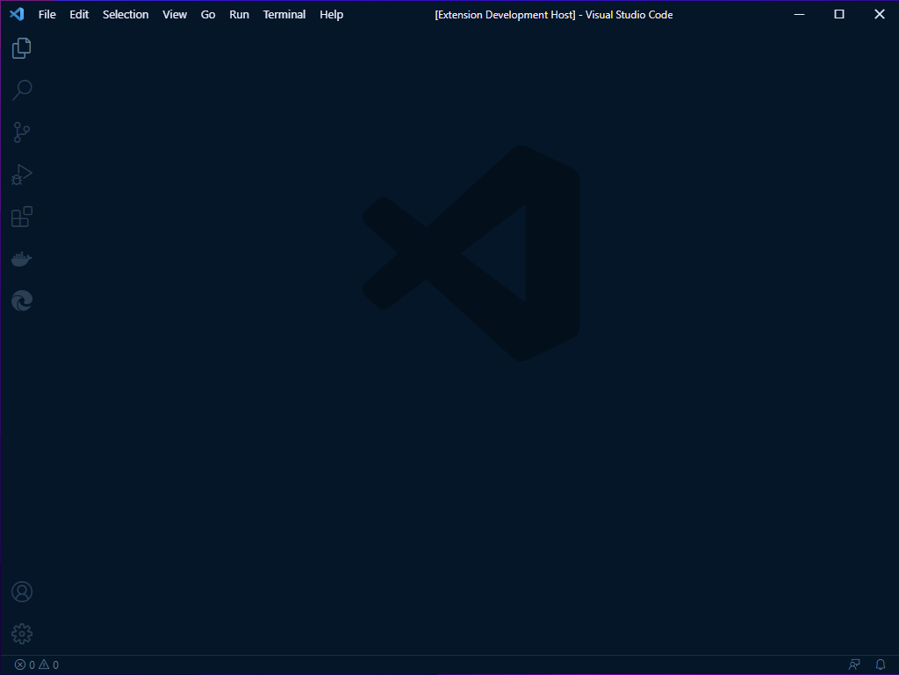
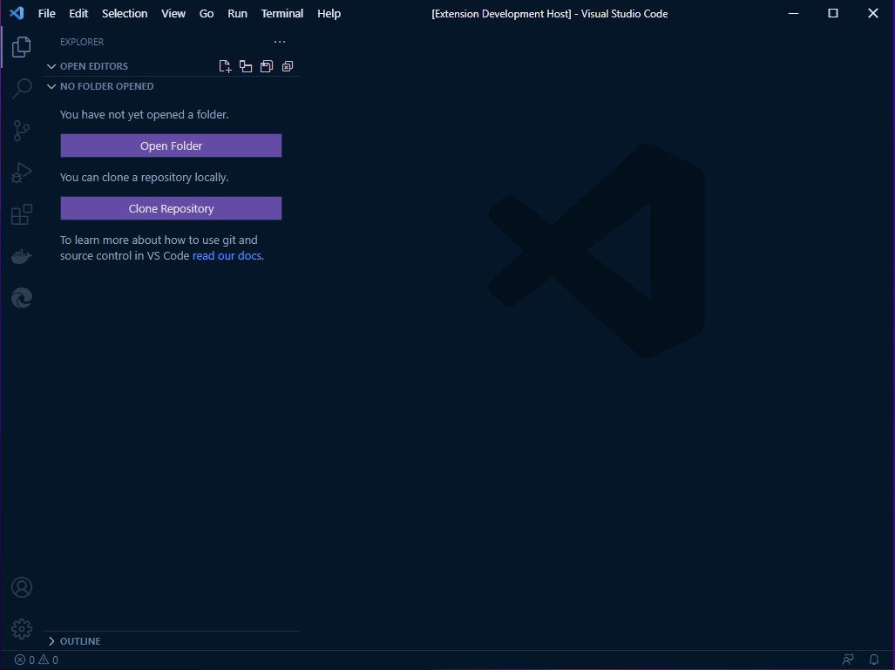
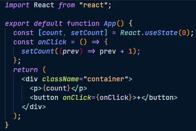

# Blah :sheep:

Fined tune Dark theme for Visual studio code! :star:
Color balanced from the Dark version for easy viewing in daylight.

## Installation

1.  Install [Visual Studio Code](https://code.visualstudio.com/)
2.  Launch Visual Studio Code
3.  Choose **Extensions** from menu
4.  Search for `blah`
5.  Click **Install** to install it
6.  Click **Reload** to reload the Code
7.  From the menu bar click: Code > Preferences > Color Theme > **Blah Dark**